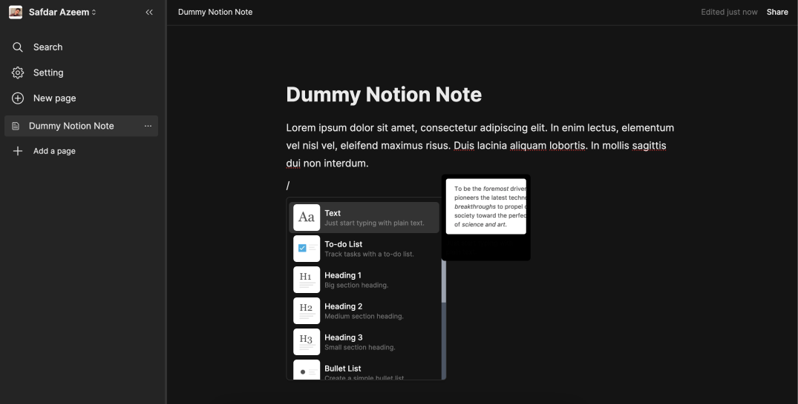

# Notion Clone Project

## Key Features

1. Replicates Notion.so UI using TailwindCSS and ShadcnUI.
2. Prioritizes responsiveness for seamless usability on all devices.
3. Implements secure sign-in and sign-up modal routes with Next.js.
4. Offers rich text editing capabilities and suggestions for enhanced collaboration.
5. Enables document management functions like creation, updating, and deletion.
6. Integrates Cloudinary CDN for easy image upload, update, and deletion.

  
 